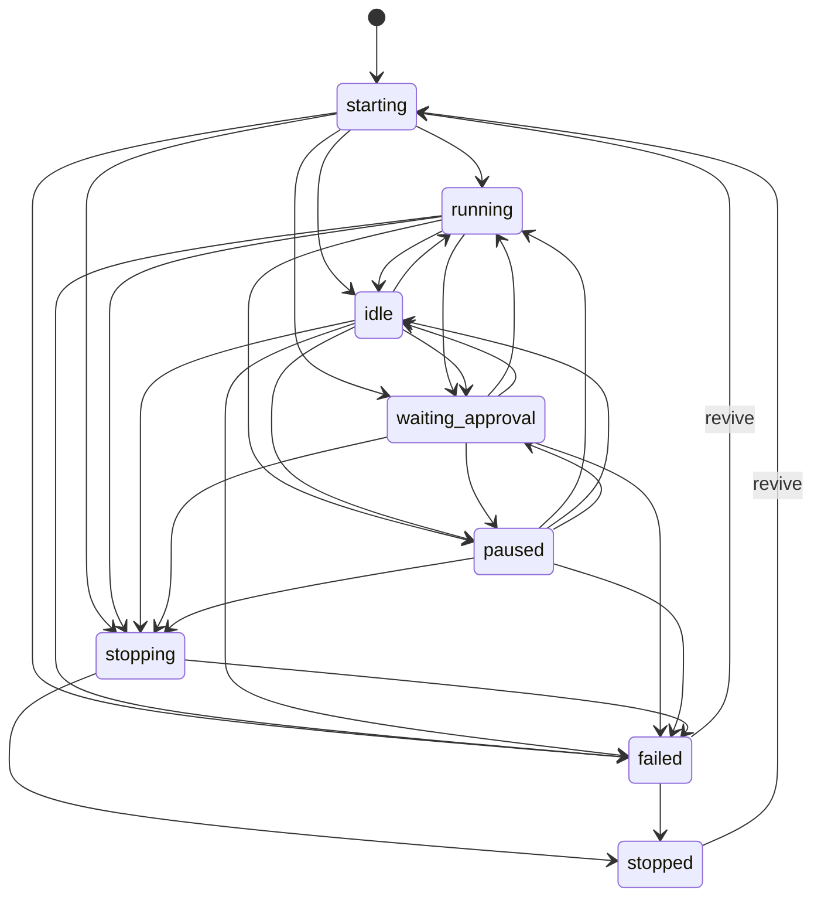

# Agent Lifecycle Model (M10.1)

Status: implemented baseline in `forge-agent` + `forge-cli` on 2026-02-12.

## Canonical agent model

Canonical model type: `forge_agent::types::AgentRecord`.

Fields:
- `id`
- `parent_agent_id`
- `workspace_id`
- `repo`
- `node`
- `harness`
- `mode` (`continuous` | `one-shot`)
- `state`
- `created_at`
- `last_activity_at`
- `ttl`
- `labels`
- `tags`

Runtime snapshot type for transport calls remains `forge_agent::types::AgentSnapshot` (subset optimized for spawn/send/wait/list).

## State machine

State enum: `forge_agent::types::AgentState`.

Transition validator: `forge_agent::lifecycle::validate_transition`.

## Transition table

Allowed transitions:
- `unspecified -> starting`
- `starting -> running|idle|waiting_approval|stopping|stopped|failed`
- `running -> idle|waiting_approval|paused|stopping|stopped|failed`
- `idle -> running|waiting_approval|paused|stopping|stopped|failed`
- `waiting_approval -> running|idle|paused|stopping|stopped|failed`
- `paused -> running|idle|waiting_approval|stopping|stopped|failed`
- `stopping -> stopped|failed`
- `stopped -> starting` (revive)
- `failed -> starting|stopped` (revive/cleanup)
- self-transition (`x -> x`) allowed for idempotent updates.

Ambiguous/backward transitions (example `idle -> starting` outside revive path) are rejected.

## Operation invariants

Operation guardrail helper: `forge_agent::lifecycle::validate_operation_state`.

Rules:
- `send_message`: allowed only in `running|idle|waiting_approval|paused`.
- `interrupt_agent`: allowed only in `running|waiting_approval|paused`.
- `kill_agent`: disallowed in `unspecified|stopped|failed`.
- `revive_agent`: allowed only in `stopped|failed`.

`MockAgentService` and `ForgedTransport` now enforce these checks before action.

## Forged proto mapping

Mapping function: `forge_agent::types::AgentState::from_proto_i32`.

Table:
- `0 -> unspecified`
- `1 -> starting`
- `2 -> running`
- `3 -> idle`
- `4 -> waiting_approval`
- `5 -> paused`
- `6 -> stopping`
- `7 -> stopped`
- `8 -> failed`

Reverse mapping via `to_proto_i32`.

## Mode contract: continuous vs one-shot

Mode enums:
- request intent: `forge_agent::types::AgentRequestMode`
- canonical runtime mode: `forge_agent::types::AgentMode`

Contract:
- `continuous`: supports follow-up sends and parent re-engagement.
- `one-shot`: single task execution; no persistence guarantees.
- command/harness mismatch is blocked by spawn capability guardrails (`forge_agent::capability`).

## Error taxonomy

Current normalized errors in `forge_agent::error::AgentServiceError` map to M10 categories:
- `not_found` -> `NotFound`
- `not_interactive` -> `InvalidState` on send/interrupt
- `dead_agent` -> `InvalidState` on terminal-state operation
- `transport_unavailable` -> `TransportUnavailable`
- `timeout_waiting_idle` -> `WaitTimeout`
- `policy_denied` -> `CapabilityMismatch` (mode/capability policy gate)

## Edge cases

- Daemon restart:
  - `get/list/send/kill` can return `TransportUnavailable`; caller retries with backoff.
- Pane missing/process exit:
  - transport may return `NotFound` or terminal `InvalidState`; command should surface actionable error.
- Approval wait:
  - `waiting_approval` is explicit state; send/interrupt allowed, wait can target this state.
- TTL expiry:
  - no dedicated `expired` proto state yet; modeled as terminal (`failed` or `stopped`) with reason in event metadata.

## Single state definition usage

`forge agent` command state parsing now resolves through `AgentState::from_str` and `AgentState::command_filter_values`, removing duplicated state string lists in CLI parser.
